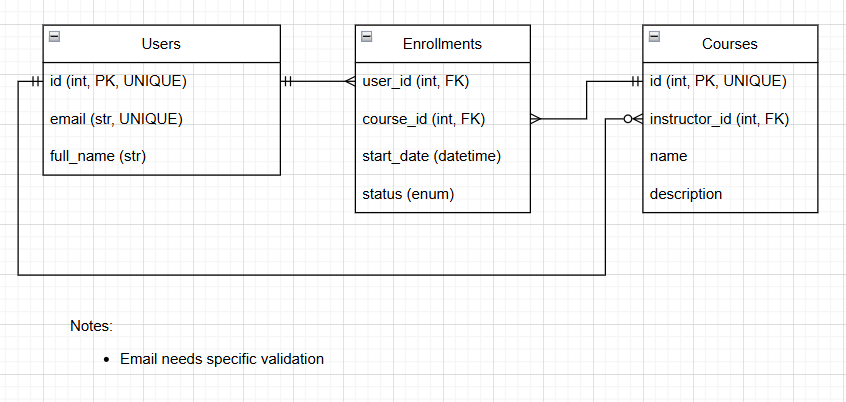

# Course Platform Challenge (Basic)

## Challenge Overview
Educational platforms like Udemy manage users, courses, and enrollments at scale. Your challenge is to design a relational database schema that efficiently stores user and course data while supporting future scalability.

This challenge focuses on schema normalization, efficient queries, and relational integrity.

### Problem Statement
You need to build a relational database schema that supports:

- User Roles – Students and instructors must be stored efficiently with minimal redundancy.
- Course Management – Courses should store structured information such as title, description, and duration.
- Enrollments – Students can enroll in multiple courses, and each course can have multiple students.
- Data Integrity – Foreign key constraints must ensure consistency between users, courses, and enrollments.
- Scalability – The database should be optimized to support thousands of users and courses.

### System Requirements
#### User Schema
- Store user details with unique emails.
- Users can be either students or instructors (tracked via a role field).

#### Course Schema
- Courses must have a title, description, and start date.
- Each course can be assigned to multiple instructors.

#### Enrollment Schema
- A many-to-many relationship should track student enrollments.
- Enrollment status should support multiple states (enrolled, completed, dropped).

## Technical Design

### Database Schema Diagram

You can view the database schema diagram above. Alternatively, you can [view the diagram here](https://drive.google.com/file/d/1CghoPV0pf40ic4QtFel1G55nUCBdNB8s/view?usp=sharing).

### Schema Details
TODO

## Checklist
- [x] Design Database
- [ ] Add Docker Compose with Postgres
- [ ] Develop API
- [ ] Add Unit Tests
- [ ] Add Load Test
- [ ] Add "Running the Project section"
- [ ] Add Postman Collection
